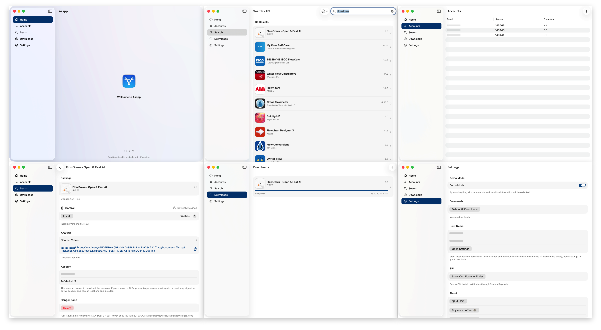

# Asspp

Seamless multi-account App Store management.

[简体中文 🇨🇳](./Resources/i18n/zh-Hans/README.md)

For a command-line or library version of Asspp, check out [ApplePackage](https://github.com/Lakr233/ApplePackage).

## 👀 Preview

## 🌟 Key Features

- **Multi-Account**: Supports multiple Apple IDs
- **Region Selection**: Choose your App Store region
- **App Search**: Search for apps by keywords
- **App Download**: Download apps from the App Store
- **IPA Install**: Install IPAs on non-jailbroken devices
- **IPA Sharing**: Share IPA files easily
- **Historical Versions**: Download previous app versions
- **Free App Purchase**: Purchase free apps

## 📝 Requirements

### Prerequisites

- [iOS App Signer](https://dantheman827.github.io/ios-app-signer/)
- Self-signed certificate for `app.localhost.qaq.wiki` (install in Settings)

### Troubleshooting

- For issues like [#1](https://github.com/Lakr233/Asspp/issues/1), use the provided signing tool.
- If installation fails, ensure the certificate is properly installed.
- For app crashes or exits, verify you've signed into your App Store account and that your device system version is supported.

### Installation Methods Comparison

| Aspect                  | Local Installation                     | AirDrop Installation                                                      |
| ----------------------- | -------------------------------------- | ------------------------------------------------------------------------- |
| Devices Required        | Single device                          | Two devices                                                               |
| App Store Compatibility | Undetectable\*                         | Compatible                                                                |
| Auto-Updates            | No                                     | Yes                                                                       |
| Prerequisites           | Install and trust certificate manually | Target device logged in with matching account, at least one app installed |
| Internet Required       | Yes                                    | No                                                                        |

- This installation method does not register the software with the App Store, so it cannot auto-update. Manual updates can retain data, but subsequent installations cannot use this software, and this method cannot overwrite existing apps.

## 🚀 Usage

# iPhone

- Visit the Releases page (https://github.com/Lakr233/Asspp/releases) and download the latest Asspp.ipa
- Re-sign the IPA with a signing tool, then install it
- Or use this Shortcut: https://www.icloud.com/shortcuts/d3c28f125b724a2da136d560fcf360dc
  > Copy the link and run it, or add the shortcut to your share sheet; when opening the link choose "Open in Sidestore"

# Mac

- Visit the Releases page (https://github.com/Lakr233/Asspp/releases) and download the latest Asspp.zip
- Unzip and open Asspp.app

### First Run and Trusting the App (Recommended)

1. Try double-clicking to open the app. If you see "App can’t be opened because the developer cannot be verified" or a similar message:
   - In Finder, locate Asspp.app, Control-click (or right-click) the app and choose "Open", then click "Open" again in the dialog. This will create a one-time trust exception for the app.
2. If Control-clicking does not work or the app is still blocked:
   - Open System Settings -> Privacy & Security (or System Preferences -> Security & Privacy on older macOS). In the General/Security section, look for the blocked app and click "Open Anyway" or "Allow". You may need to enter an administrator password.
3. Recommendation: Download from this repository's Releases and verify the release details to ensure the source is trusted before trusting and opening the app.

> These steps follow macOS Gatekeeper practices and help minimize security risks while allowing you to run unsigned or self-signed apps.

## 📋 Prebuilt Package

Check the [Releases](https://github.com/Lakr233/Asspp/releases) page.

## 🧑‍⚖️ License

Starting from version 2.2.16, the project is licensed under [MIT](./LICENSE).

## 🥰 Acknowledgments

- [ipatool](https://github.com/majd/ipatool)
- [ipatool-ios](https://github.com/dlevi309/ipatool-ios)
- [localhost.direct](https://get.localhost.direct/)

`ipatool-ios` and `localhost.direct` are no longer used in the project.

---

Copyright © 2025 Lakr Aream. All Rights Reserved.
